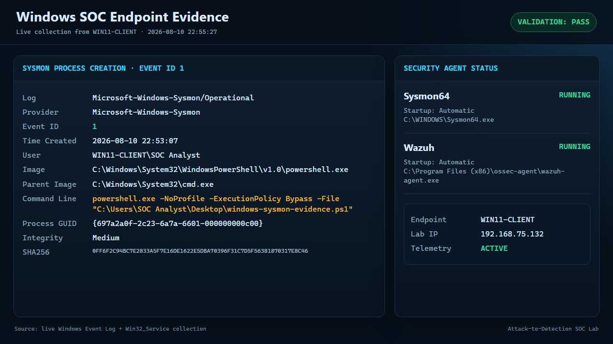
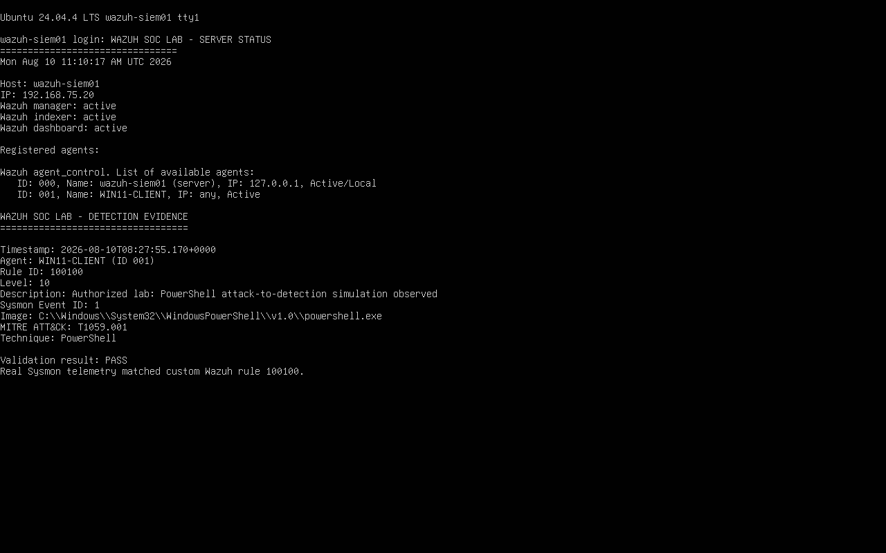
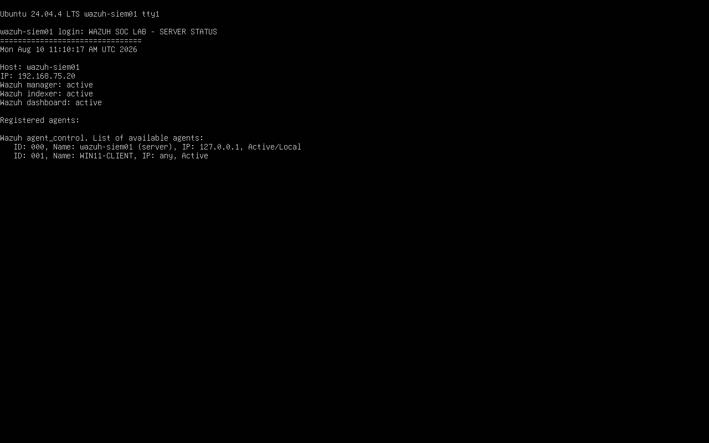
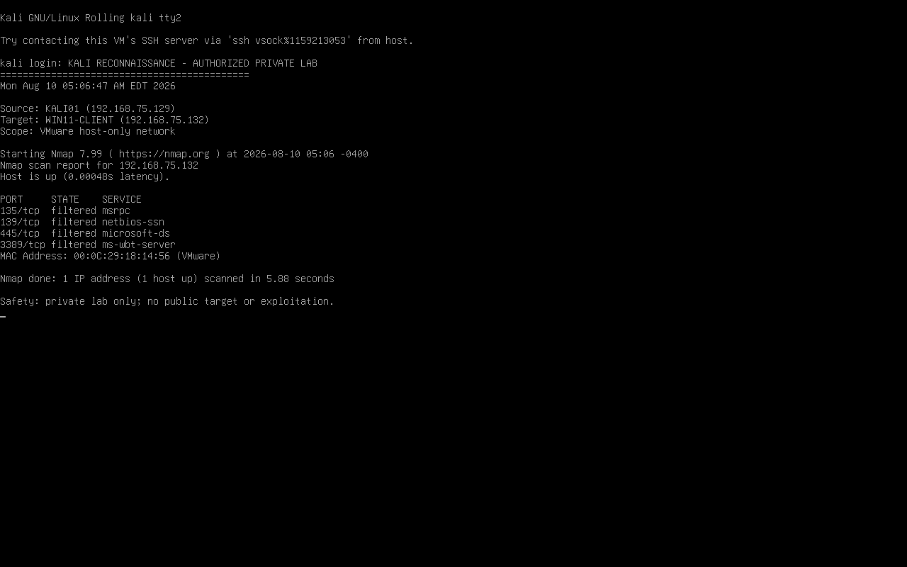
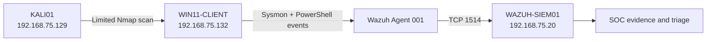

# Attack-to-Detection Lab: Kali, Windows, Sysmon, and Wazuh

This project demonstrates a complete, safe purple-team workflow in an isolated VMware network: controlled reconnaissance from Kali, endpoint telemetry on Windows 11, collection by Wazuh, and evidence-based SOC triage.

## Recruiter quick view

| Area | Demonstrated outcome |
|---|---|
| Detection engineering | Created and validated Wazuh rule `100100` at alert level `10` |
| Endpoint telemetry | Collected Sysmon process, file-creation, and network events |
| SOC investigation | Preserved sanitized evidence and documented analyst conclusions |
| Threat mapping | Mapped the activity to MITRE ATT&CK techniques |
| Safe attack simulation | Ran limited reconnaissance only inside an isolated VMware network |

**Start here:** [Incident report](docs/incident-report.md) · [Command log](docs/commands.md) · [Detection evidence](evidence/detection-summary.txt)

## Evidence gallery

### Windows endpoint telemetry

Live collection from `WIN11-CLIENT` confirms Sysmon process-creation telemetry (Event ID `1`) and verifies that both Sysmon and the Wazuh agent are running automatically.



### Confirmed Wazuh detection

The manager received real Sysmon telemetry from `WIN11-CLIENT` and matched custom rule `100100` at level `10`, mapped to MITRE ATT&CK `T1059.001`.



### Wazuh services and endpoint status

Manager, indexer, and dashboard services are active, and agent `001` reports as active.



### Controlled Kali reconnaissance

The scan targeted only the isolated Windows VM. The endpoint was reachable and the selected Windows service ports were filtered.



## What was built



All three systems use the private `VMnet1` laboratory network. No public host or third-party system was scanned.

## Validated results

- Microsoft Sysmon installed with a valid Microsoft digital signature.
- `Sysmon64` and `WazuhSvc` are running automatically.
- The Wazuh agent analyzes both the Sysmon and PowerShell Operational channels.
- Wazuh agent `001` connected to `192.168.75.20:1514/tcp` and reported online.
- Custom Wazuh rule `100100` passed configuration validation and loaded successfully.
- A real event from `WIN11-CLIENT` matched rule `100100` at alert level `10`.
- Safe PowerShell activity produced:
  - Sysmon Event ID `1`: process creation.
  - Sysmon Event ID `11`: file creation under `C:\Lab`.
  - Sysmon Event ID `3`: network connection to the internal Wazuh server.
- Kali ran a limited Nmap scan against four Windows ports. The host was reachable and every tested port was filtered.

## Detection scenarios

| Scenario | Evidence | Analyst conclusion |
|---|---|---|
| PowerShell execution | Sysmon Event ID 1 | Command execution was captured with user, integrity level, command line, and SHA-256 hash |
| Marker-file creation | Sysmon Event ID 11 | Endpoint file activity under the lab path was captured |
| Internal connection test | Sysmon Event ID 3 | Network telemetry recorded the Windows-to-Wazuh connection |
| Kali reconnaissance | Nmap evidence | Windows was online; firewall filtering protected the tested services |
| Custom SIEM detection | Wazuh rule 100100, level 10 | The PowerShell simulation produced a confirmed manager-side alert |

## Repository structure

```text
config/       Focused Sysmon configuration
scripts/      Installation, simulation, and evidence-collection scripts
docs/         Command log and incident report
evidence/     Sanitized validation results
```

## Reproduce the lab

Follow [docs/commands.md](docs/commands.md). Credentials are always supplied at runtime and are deliberately excluded from every file in this repository.

## Safety boundaries

- Run only inside the authorized local lab.
- Do not replace the target IP with a public or third-party address.
- Use the harmless simulation script; no malware or exploit code is included.
- Do not disable Windows Defender or the firewall.
- Never commit credentials, enrollment keys, VM disks, or raw private logs.

## Skills demonstrated

Windows telemetry, Sysmon, custom Wazuh rules, Wazuh agent configuration, Nmap reconnaissance, PowerShell, event triage, evidence handling, MITRE ATT&CK mapping, Git, and security-focused documentation.

## Portfolio progression

This project extends the foundational [Windows SOC Home Lab with Wazuh](https://github.com/Eliran1991-sudo/SOC-Lab-Portfolio) by adding Sysmon telemetry, controlled Kali reconnaissance, custom detection logic, and deeper incident analysis.
