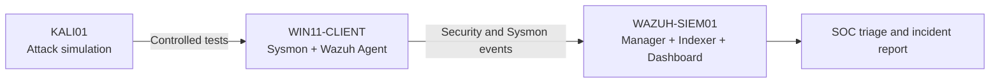

# Attack-to-Detection Lab with Kali, Windows, Sysmon, and Wazuh

This project follows a complete purple-team workflow: generate controlled activity from an isolated attack host, collect endpoint telemetry from Windows, detect it in Wazuh, and document the SOC investigation.

## Objective

Demonstrate the full chain from attacker activity to analyst decision:

1. Generate safe and authorized activity in an isolated VMware network.
2. Collect enhanced Windows telemetry with Sysmon and the Wazuh agent.
3. Detect authentication failures, process execution, network scanning, and file changes.
4. Correlate events with MITRE ATT&CK.
5. Produce evidence-based incident reports.

## Planned architecture

All systems communicate only through the private `VMnet1` laboratory network.

## Current status

- [x] Wazuh server verified
- [x] Windows endpoint verified as active agent `001`
- [x] Windows account discovered from Wazuh inventory: `SOC Analyst`
- [x] Existing Windows Event IDs `4625` and `4688` validated
- [ ] Authenticate to the Windows guest for controlled administration
- [ ] Install and configure Sysmon
- [ ] Verify Sysmon Event Channel collection in Wazuh
- [ ] Start KALI01 and record its isolated IP address
- [ ] Run controlled Nmap and authentication-failure scenarios
- [ ] Run a safe PowerShell simulation
- [ ] Validate detections and create incident reports

## Detection scenarios

| Scenario | Expected telemetry | SOC objective |
|---|---|---|
| Nmap scan from Kali | Sysmon network connections and Windows firewall events | Identify reconnaissance |
| Failed authentication | Windows Security Event ID 4625 | Triage repeated login failures |
| PowerShell test command | PowerShell Operational logs and Sysmon process creation | Detect suspicious command execution |
| Monitored file creation | Sysmon file events and Wazuh FIM | Validate endpoint file monitoring |

## Command-by-command record

Every host and guest command is documented in [docs/commands.md](docs/commands.md). Passwords, enrollment keys, and private keys are never recorded.

## Safety rules

- Use only the isolated local lab.
- Do not target public IP addresses or third-party systems.
- Use harmless simulation commands rather than malware.
- Do not disable security controls to make a test succeed.
- Do not store credentials in Git or screenshots.

